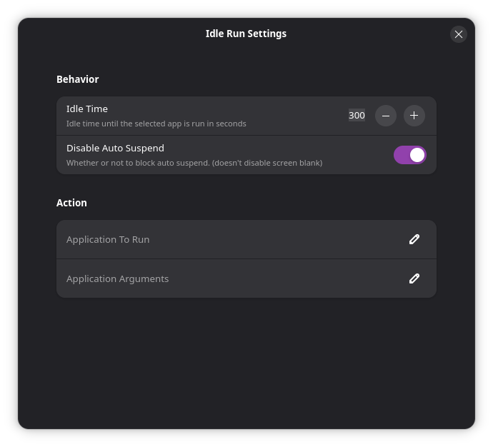

# Idle Run
A small gnome extension that runs a specified app after the user is idle for a certain amount of time. This is useful to run screen saver applications.

## Behavior
After being idle for the time specified in **"Idle Time"** the application set in **"Application To Run"** is executed with the arguments set in **"Application Arguments"**. When the user is no longer idle the executed application is automatically closes with the signal SIGTERM.

> Note: Disabling auto suspend does not disable automatic screen blank. To disable this open settings and disable "Automatic Screen Blank" under `Power > Power Saving > Automatic Screen Blank`